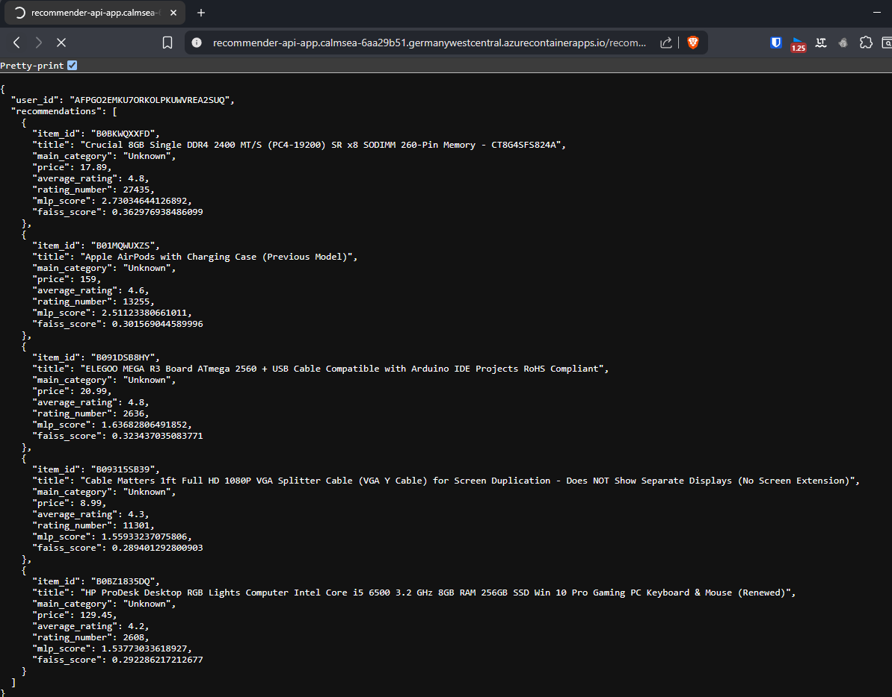
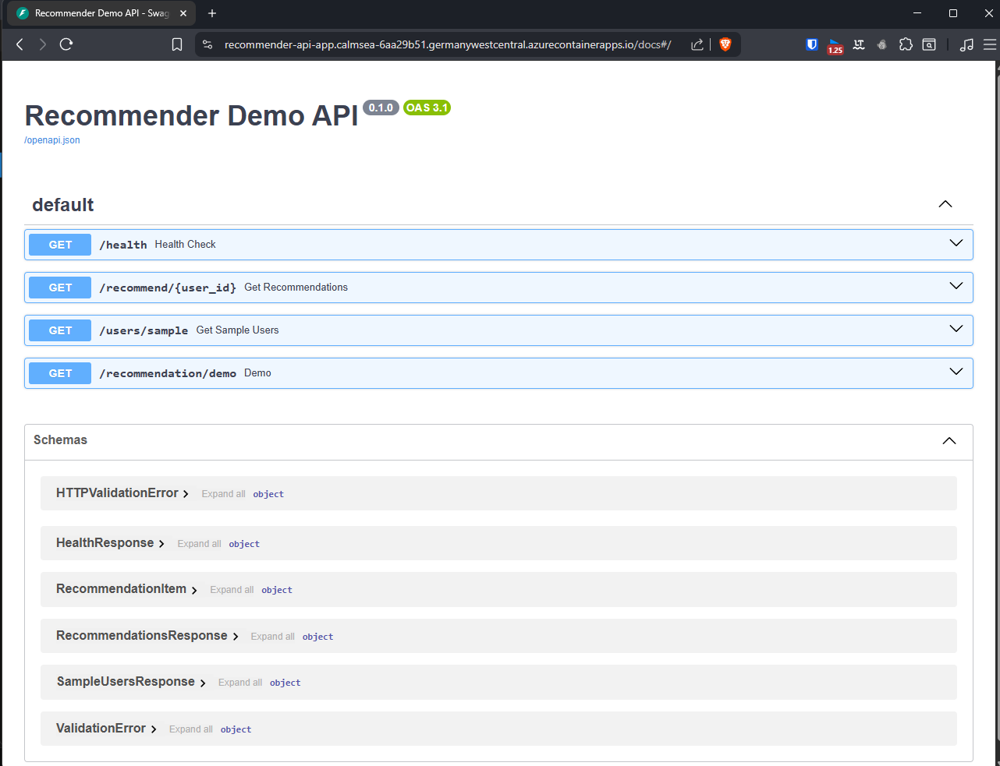
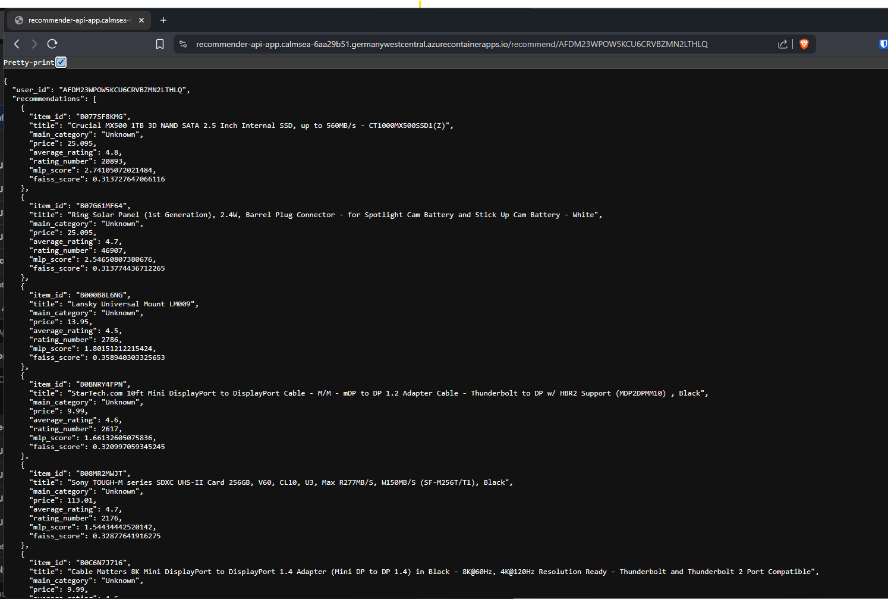

# Amazon Electronics Recommender System

This project is an **end-to-end recommendation system** built from the Amazon Reviews 2023 Electronics dataset. It covers the full lifecycle:  
data preparation → model development → evaluation → scalable deployment as a REST API on Azure Container Apps.  

[Live Demo (Azure Container App)](https://recommender-api-app.calmsea-6aa29b51.germanywestcentral.azurecontainerapps.io/recommendation/demo)

---

## Key Features
- **Data Engineering**
  - Started from a strict 5-core subset (users and items with ≥5 interactions).  
  - Sampled ~2.5% of users, keeping all their interactions to preserve temporal coherence.  
  - Retained items with at least one interaction among these users.  
  - Final dataset: **41,909 users, 136,934 items, 390,757 interactions** (sparser than full 5-core).  
  - Applied chronological train/val/test splits and engineered features (price, ratings, categories, text embeddings).


- **Modeling**
  - Implemented and compared four model families:
    - Matrix Factorization (baseline CF)  
    - Hybrid CF + metadata  
    - Hybrid CF + SBERT text embeddings  
    - Two-Tower MLP with metadata + text (best performing)
  - Optimized with Bayesian Personalized Ranking (BPR) loss and multi-seed validation.
  - Achieved consistent improvements in NDCG@10 with text + MLP models.

- **Retrieval & Serving**
  - Built a **two-stage pipeline**: FAISS retrieval for candidate generation + MLP re-ranking.
  - Packaged inference assets (model, FAISS index, metadata, embeddings) for reproducible deployment.
  - Exposed as a REST API with **FastAPI**, returning JSON responses for easy integration.
    - `/health` → system status  
    - `/users/sample` → sample user IDs  
    - `/recommend/{user_id}` → personalized recommendations  
    - `/recommendation/demo` → demo with random user  

- **Deployment**
  - Containerized with Docker (`python:3.12-slim` base).
  - Deployed as a public **Azure Container App** with scale-to-zero for cost efficiency.
  - Inference latency <100ms per request on CPU.


---

## Tech Stack
- **Languages & Libraries**: Python, PyTorch, FAISS, FastAPI, NumPy, Pandas  
- **NLP**: SBERT (SentenceTransformer all-MiniLM-L6-v2) for item title embeddings  
- **Experimentation**: Hyperparameter search, multi-seed evaluation, HR@K & NDCG@K metrics  
- **Deployment**: Docker, Azure Container Apps 

---

## Reproducibility
1. Train model:
   ```bash
   python scripts/Recommendation_System/train.py
   ```
2. Build FAISS index:
   ```bash
   python scripts/Recommendation_System/build_FAISS_index.py
   ```
3. Run API locally:
   ```bash
   uvicorn scripts.Recommendation_System.recommender_api:app --reload
   ```
4. Build Docker image:
   ```bash
   docker build -t recsys-api -f DOCKERFILE .
   docker run -p 8000:8000 recsys-api
   ```

## Docker Hub Image
The API is also available as a prebuilt Docker image:  

[Docker Hub – rahulk98/amazon-electronics-recommender-api](https://hub.docker.com/r/rahulk98/amazon-electronics-recommender-api)

Run locally with:
```bash
docker pull rahulk98/amazon-electronics-recommender-api:latest
docker run -p 8000:8000 rahulk98/amazon-electronics-recommender-api:latest
```
---
## Evaluation Results (Multi-Seed)

| Model              | NDCG@10 (mean) | Notes                        |
|--------------------|----------------|------------------------------|
| Collaborative Filtering | 0.3051        | Baseline CF (BPR loss)       |
| Hybrid (metadata)  | 0.2861        | Used category + numeric only |
| Hybrid + Text      | 0.3311        | SBERT title embeddings added |
| Two-Tower MLP      | 0.3342        | Best overall, scalable       |

Improved NDCG@10 from 0.305 (CF baseline) to 0.334 (Two-Tower MLP + text), confirming the value of combining collaborative, metadata, and text signals.

---

## Project Highlights
- Built a scalable recommendation system on Amazon Reviews dataset (41K users, 137K items, 391K interactions).  
- Improved ranking performance with metadata + SBERT text embeddings.  
- Designed a two-stage retrieval pipeline (FAISS + MLP rerank) for sub-100ms inference.  
- Deployed as a REST API on Azure Container Apps with Docker and CI/CD workflows.  

---

## API Demo Screenshots

### Demo Recommendations
  
*Sample recommendations returned for a random user via `/recommendation/demo`.*

### Swagger Docs
  
*Interactive API documentation generated by FastAPI.*

### Single User Query
  
*Personalized recommendations for a specific user via `/recommend/{user_id}`.*
